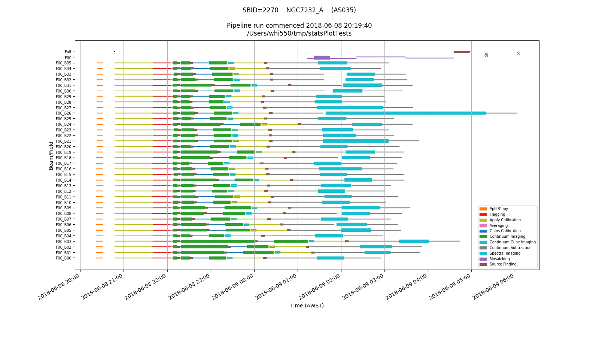

Diagnostics and job management
==============================

Running the processASKAP.sh script will also create two scripts that
are available for the user to run. These reside in the tools/
subdirectory, and are tagged with the date and time that
processASKAP.sh was called. Symbolic links to them are put in the top
level directory. These scripts are:

* *reportProgress* – (links to *tools/reportProgress-YYYY-MM-DD-HHMMSS.sh*)
  This is a front-end to squeue, showing only those jobs started by
  the most recent call of *processASKAP.sh*. If given a ``-v`` option, it
  will also first provide a list of the jobs along with a brief
  description of what that job is doing.
  
* *killAll* – (links to *tools/killAll-YYYY-MM-DD-HHMMSS.sh*) This is a
  front-end to *scancel*, providing a simple way of cancelling all jobs
  started by the most recent call of *processASKAP.sh*.
  
In each of these cases, the date-stamp (*YYYY-MM-DD-HHMMSS*) is the time
at which *processASKAP.sh* was run, so you can tie the results and the
jobs down to a particular call of the pipeline.

If you have jobs from more than one call of *processASKAP.sh* running
at once, you can run the individual script in the tools directory,
rather than the symbolic link (which will always point to the most
recent one).

The list of jobs and their descriptions (as used by reportProgress) is
written to a file jobList (which is a symbolic link, linking to
*slurmOutput/jobList-YYYY-MM-DD-HHMMSS.txt*). There are symbolic links
created in the top level directory (where the script is run) and in
the output directory.

For future reference, the configuration file is also archived in the
*slurmOutput* directory, with the timestamp added to the filename.
This will allow you to go back and see exactly what you submitted
each time.

Each of the individual askapsoft tasks produces a log file that
includes a report of the time taken and the memory used. The
processing scripts extract this information and place them in both
ascii table and csv formatted files in the stats/ directory. These
files are named with the job ID, the number of cores used, a description of the task, along
with an indication of whether the job succeeded ('OK') or failed
('FAIL'). For distributed jobs, a distinction is made between the
master process (rank 0) and the worker processes, and for the workers
both the peak and average memory useage are reported. This is
important for tasks like **cimager** where there are clear differences
between the memory usage on the master & worker nodes.

Upon completion of all the jobs, these files are combined
into single tables, placed in the top-level directory and labelled
with the same time-stamp as above. Here is an excerpt of a typical
stats file::

     JobID    nCores                                       Description   Result      Real      User    System    PeakVM   PeakRSS                StartTime
   4460004         1                                    split_BPCALB00       OK       8.9      0.73      1.08       487       136  2018-06-08T20:21:24,630
   4460005         1                                 flag_BPCALB00_Dyn       OK     10.33      9.34      0.44       470       120  2018-06-08T20:21:39,974
   4460077         1                              applyBP1934_BPCALB00       OK     21.91     21.27      0.53       483       146  2018-06-08T20:47:30,309
   4460113         1                                      split_F00B00       OK    544.95     64.02    149.75       531       181  2018-06-08T20:21:42,092
   4460114         1                                    applyBP_F00B00       OK   3119.34   3060.18     51.39       483       146  2018-06-08T20:47:30,310
   4460115         1                                   flag_F00B00_Dyn       OK   1469.36   1375.93      64.4       471       121  2018-06-08T21:39:42,799
   4460116         1                                        avg_F00B00       OK    143.78     85.39      41.1       540       175  2018-06-08T22:04:22,974
   4460117         1                                 flagAv_F00B00_Dyn       OK     42.18     37.79      1.64       406        56  2018-06-08T22:06:57,483
   4460118       145                           contSC_F00B00_L0_master       OK    308.06    289.86     17.97      6379      4002  2018-06-08T22:07:56,605
   4460118       145                       contSC_F00B00_L0_workerPeak       OK    308.06    289.86     17.97      4561      2466  2018-06-08T22:07:56,605
   4460118       145                        contSC_F00B00_L0_workerAve       OK    308.06    289.86     17.97    2158.8    1541.2  2018-06-08T22:07:56,605
   4460118       145                           contSC_F00B00_L1_master       OK    736.05    605.89     129.9      7160      4002  2018-06-08T22:18:44,012
   4460118       145                       contSC_F00B00_L1_workerPeak       OK    736.05    605.89     129.9      5577      2466  2018-06-08T22:18:44,012
   4460118       145                        contSC_F00B00_L1_workerAve       OK    736.05    605.89     129.9    2222.0    1541.2  2018-06-08T22:18:44,012    

This information is also presented graphically, in a PNG image (statsPlot-YYYY-MM-DD-HHMMSS.png, which
is put in both the top-level directory and the *diagnostics*
directory. Here is an example:

Each row in the plot corresponds to a single beam/field combination,
with mosaicking jobs for a given field getting their own row, and
mosaicking and source-finding jobs for the overall observation getting
a further row (at the top).
           
Each type of job has its own colour, and the width of the line for
each job indicates the number of cores used. Jobs that fail are
represented by crosses at the start time.
