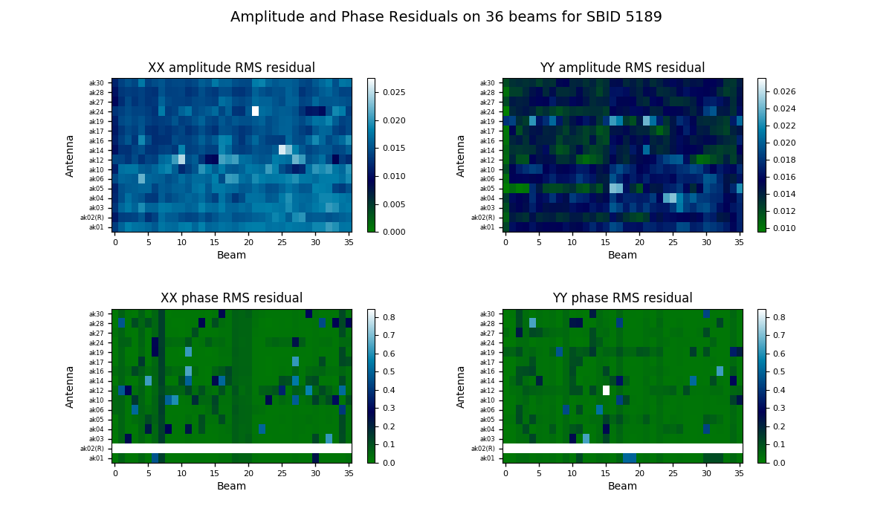
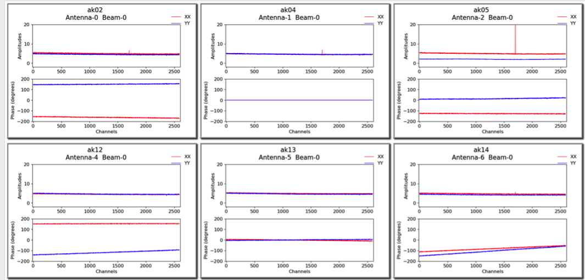
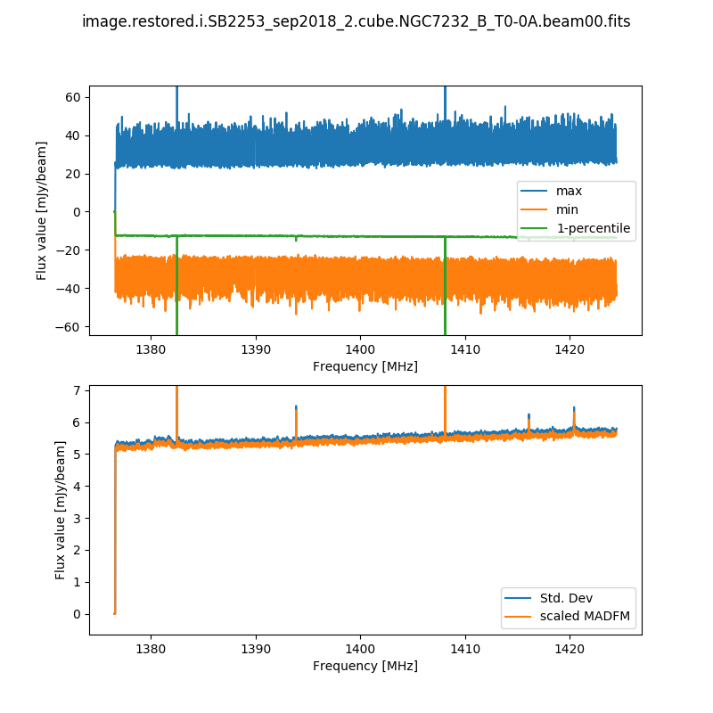
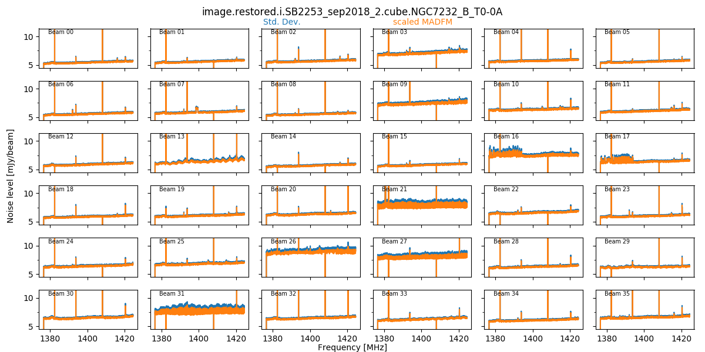
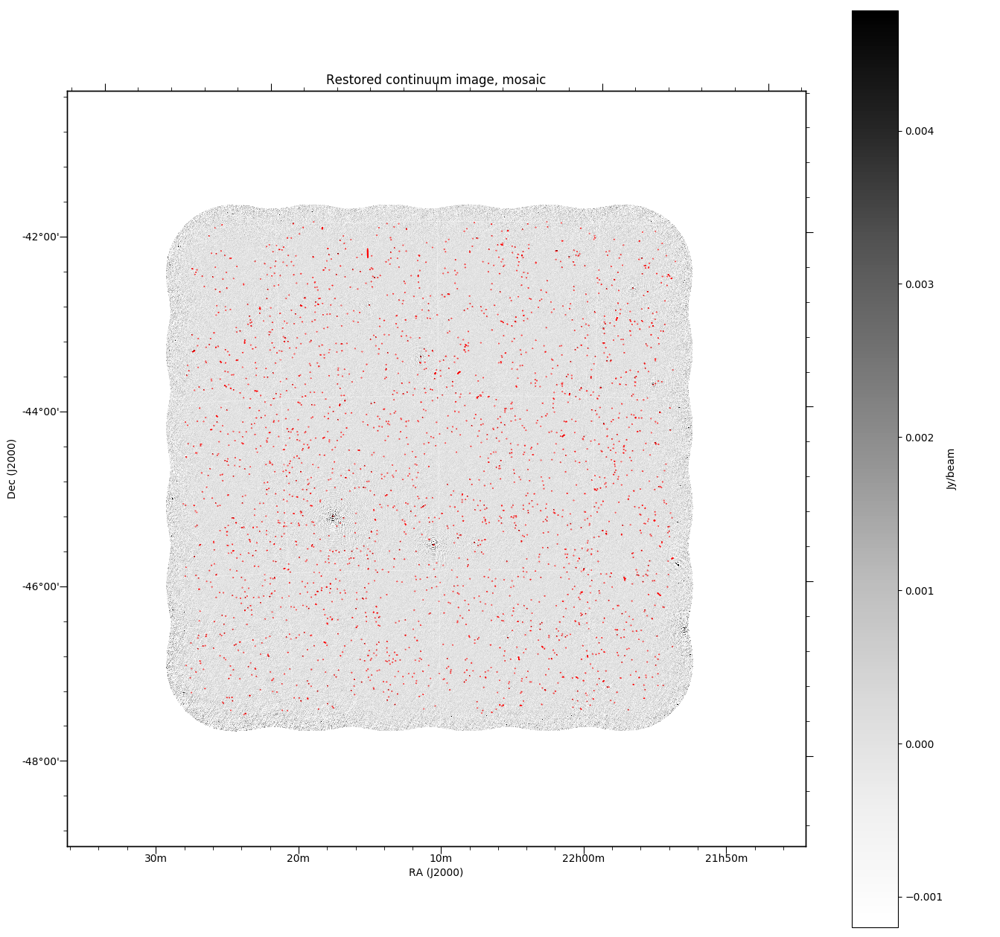

Validation and Diagnostics
==========================

The pipeline produces a number of diagnostic plots to help the user assess the quality of the processing.

Bandpass validation
-------------------

Upon completion of the determination of the bandpass calibration solutions, a python script runs to provide a validation assessment of the solutions. This produces several plots that can be used to assess the bandpass quality.

As described on :doc:`BandpassCalibrator`, there are options to smooth the bandpass and produce plots of the individual antenna/beam solutions, with two tools provided.

The bandpass validation script provides additional plots to more quickly assess the quality, highlighting potential antennas and/or beams that warrant further investigation. The main plot gives a quality metric for each solution. For each beam and antenna combination, a low-order polynomial is fitted to the amplitude and phase spectra in each polarisation (XX & YY). This is subtracted from the spectrum, and the RMS of the residuals is computed. This is shown as a colour map for all antennas and beams, allowing obviously discrepant antenna/beam combinations to be rapidly identified.

A more detailed plot of the bandpass solutions for each antenna/beam combination (plotted separately as amplitude and phase for each polarisation) is also provided in the *diagnostics* directory. This will be named for the bandpass calibration table, but with a *.pdf* extension (for it is a PDF file - each page showing all beams for a single antenna). Here is an example of the style of plots:

           

Spectral cube diagnostics
-------------------------

When the spectral cubes are created, there are additional metadata files provided for diagnostic purposes.

The first is the beam log. When the "fit" option for the restoring beam is used, the beamlog file records the BMAJ, BMIN, BPA parameters for each channel. Only one is recorded in the image header.

The second records the cube statistics. For each channel, this file (cubeStats-<image name>.txt) records the following statistics for each channel: Mean flux, Standard deviation, Median flux, Median absolute deviation from the median (scaled to the equivalent standard deviation for Normal statistics), the 1-percentile flux, and the minimum and maximum flux. This is done by an MPI-enabled python script, run immediately following the imaging and using the same cores to process the data rapidly. This script also produces a plot of the noise levels and the flux range as a function of frequency:

This is done for all cubes, both the spectral-line cubes and the continuum cubes. There will be one such file and plot for each beam, as well as one for each mosaic (including restored image, model image, residual, and contsub where appropriate).

When the final mosaicking is completed, a summary plot showing all beams for a given field is produced. This produces three plots, showing the noise, the min & max, and the PSF size/shape information, all as a function of channel. Here is an example of the noise plot, showing the variation in noise measurements as a function of channel and beam (note that these are made on the non-primary-beam corrected single-beam images):

These field-based plots will be found in the *diagnostics* directory, along with a directory containing the individual beam statistics catalogues (cubeStats and beamlogs).

The scripts used to produce these plots are as follows:

 * *findCubeStatistics.py* - Calculates the statistics for a single cube, and produces the first plot shown above. Can be run under MPI with multiple cores - the available channels are distributed across the cores, and the information gathered at the end. Run via `findCubeStatistics.py -c <imageCube.fits>`
 * *beamwiseCubeStats.py* - Produces the second plot shown above, as well as the same plot but for the min/max/1-percentile spectra. This assumes all beam images have the same name and are in the same directory. You provide it with the beam00 image, and it will automatically find the rest. Run via `beamwiseCubeStats.py -c image.i.cube.beam00.fits` (even if you don't have a beam00 image, still give that as the input).
 * *beamwisePSFstats.py* - Produces the equivalent of the second plot shown above, but for the PSF statistics. Again, this assumes all beam images have the same name and are in the same directory. You provide it with the beam00 image, and it will automatically find the rest. Run via `beamwisePSFstats.py -c image.i.cube.beam00.fits` (even if you don't have a beam00 image, still give that as the input).

Continuum image diagnostics
---------------------------

All continuum images will (when the ``DO_MAKE_THUMBNAILS=true`` is set) have a PNG greyscale image produced (this is used as a preview in CASDA, but is useful as a quick-look diagnostic). The pipeline will also produce additional diagnostic plots (when ``DO_DIAGNOSTICS=true``) that show the location of continuum components on both the restored image and the noise map (that is produced by Selavy in the source-finding). These will be found also in the *diagnostics* directory. The former looks something like this:

Flagging summaries
------------------

For both the spectral datasets and the averaged (continuum) datasets, the pipeline will produce text files that summarise the flagging statistics. These will be written to the *diagnostics* directory, and will be named for the measurement set in question, with a *.flagSummary* appended to the filename.

These files will list the percentage of data flagged for each integration & baseline, along with summaries for each integration. A future release will provide a graphical representation of this data as well.

