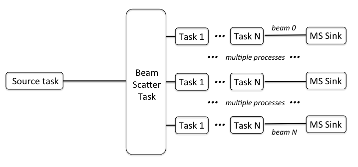

BeamScatterTask
================

BeamScatterTask allows to split a single stream of data into multiple streams distributing data by beam.
The beam space is sliced as evenly as possible between all available (or configured) ranks to handle 
output streams. If the number of such ranks is larger than the number of beams available, each output
stream will contain data for just one beam (and therefore will result in one beam per file, if data are 
written as part of the downstream processing). The diagram below illustrates the operation.

By default, the task uses service ranks to handle the output if possible. However, if the number of 
available service ranks is insufficient to cover all output streams, ranks receiving data will be reused
starting from those which are inactive (i.e. not sending data to this particular task) in the order of the
global rank number. It is currently the requirement that the rank providing input data stream 
is also one of the ranks handing the output. 

Configuration Parameters
------------------------

The program requires a configuration file be provided on the command line. This
section describes the valid parameters. In addition to mandatory parameters which are
always required, individual tasks often have specific parameters which need to be
defined only if a particular task is used. As for all tasks, parameters are taken
from keys with tasks.\ **name**\ .params prefix (not shown in the table below) where
**name** is an arbitrary name assigned to this task and used in *tasklist* (this allows us
to run the same task more than once with different parameters). The type of
the task defined by tasks.\ **name**\ .type should be set to *BeamScatterTask*.

+----------------------------+-------------------+------------+--------------------------------------------------------------+
|**Parameter**               |**Type**           |**Default** |**Description**                                               |
|                            |                   |            |                                                              |
+============================+===================+============+==============================================================+
|nstreams                    |unsigned int       |All         |The number of data streams to produce (by default, all availa\|
|                            |                   |service     |ble service ranks). The beam space is split as uniformly as   |
|                            |                   |ranks       |possible between output streams. If the number of beams in the|
|                            |                   |            |input stream is smaller than the chosen number of output stre\|
|                            |                   |            |ams, then only required number of output streams will be used,|
|                            |                   |            |starting with the rank with smaller number.                   |
+----------------------------+-------------------+------------+--------------------------------------------------------------+

Example
~~~~~~~

.. code-block:: bash

    ########################## ChannelMergeTask ##############################

    tasks.tasklist = [MergedSource, Merge, CalcUVWTask, BeamScatterTask, MSSink]

    # number of ranks to merge, 12 cards correspond to 48 MHz of bandwidth
    task.Merge.params.ranks2merge = 12
    # type of the task
    tasks.Merge.type = ChannelMergeTask

    tasks.BeamScatterTask.type = BeamScatterTask

    

