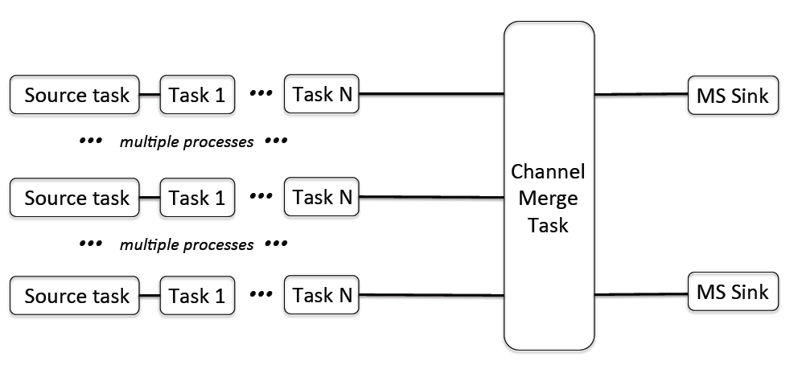

ChannelMergeTask
================

ChannelMergeTask allows to merge parallel streams of data in channel space and reduce the number of 
active streams accordingly. This allows us, for example, to run more source tasks than files written
or process smaller chunks of bandwidth initially in the task chain and bigger chunks later on. The
diagram below illustrates the merge operation.

By design, all ranks of ingest pipeline are active at the start of the processing chain. The number
of source tasks is equal to the total number of ranks available and, therefore, this is the number
of data streams received from the correlator Input Output Controllers (IOCs). Each source task listens
its own data port (the port number given in the configuration is incremented for each rank). The following
tasks in the processing chain (tasks 1 to N in the diagram) work on the data received by the corresponding
source task (i.e. the number of parallel data streams is equal to the number of ranks). The ChannelMergeTask
stacks half of the chunks together making only two active data streams later in the chain. Note, in this
setup, the total number of ranks should be even (i.e. there should be no dangling data streams not
contributing to the output). The data are joined based on the rank number. However, the task
checks that the resulting frequency axis is contiguous.  Therefore, bandwidth should be split in the 
contiguous fashion between source tasks (by the configuration of the hardware and software). Otherwise,
an exception will be raised. The diagram shows MSSink task at the end of the chain. In the current setup,
only two files will be written (because there are only two active chunks). A second merge task can be 
present in the task chain after MSSink to provide full bandwidth for monitoring. This is the most likely
setup for ASKAP12 early science (recording is I/O bandwidth limited, so two files need to be written, but
full bandwidth can be monitored via TCPSink as long as we have only 12 antennas).

Configuration Parameters
------------------------

The program requires a configuration file be provided on the command line. This
section describes the valid parameters. In addition to mandatory parameters which are
always required, individual tasks often have specific parameters which need to be
defined only if a particular task is used. As for all tasks, parameters are taken
from keys with tasks.\ **name**\ .params prefix (not shown in the table below) where
**name** is an arbitrary name assigned to this task and used in *tasklist* (this allows us
to run the same task more than once with different parameters). The type of
the task defined by tasks.\ **name**\ .type should be set to *ChannelMergeTask*.

+----------------------------+-------------------+------------+--------------------------------------------------------------+
|**Parameter**               |**Type**           |**Default** |**Description**                                               |
|                            |                   |            |                                                              |
+============================+===================+============+==============================================================+
|ranks2merge                 |unsigned int       |All         |The number of consecutive ranks for which the data are merged |
|                            |                   |available   |to be processed in a single parallel stream. The rank with the|
|                            |                   |            |lowest number in this group will remain active and the rest   |
|                            |                   |            |are deactivated. For example, if the total number of available|
|                            |                   |            |ranks is 12 and this parameter is set to 6 then ranks 0 and 6 |
|                            |                   |            |will remain active and will handle half of the bandwidth each.|
+----------------------------+-------------------+------------+--------------------------------------------------------------+

Example
~~~~~~~

.. code-block:: bash

    ########################## ChannelMergeTask ##############################

    tasks.tasklist = [MergedSource, Merge, CalcUVWTask, MSSink]

    # number of ranks to merge, 12 cards correspond to 48 MHz of bandwidth
    task.Merge.params.ranks2merge = 12
    # type of the task
    tasks.Merge.type = ChannelMergeTask

    

