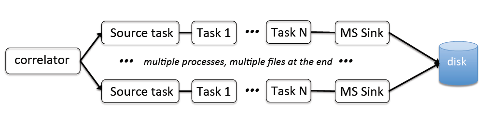

Ingest pipeline 
================

The *ingest pipeline* is the central component of the data acquision part
of the system. It is responsible for producing self-contained measurement sets
with the visibility data and appropriate metadata. Under normal circumstances,
the *ingest pipeline* is started by the *Central Processor Manager*. The latter
also has the ability to abort *ingest pipeline*. However, under typical operation
it does not "stop" the ingest pipeline, it stopes when the metadata flowing from
the Telescope Operating System's Executive component indicates an observation has
concluded. The *Executive* assembles configuration file for the *ingest pipeline*
based on the current observation and the *Facility Configuration Manager* 
hostiting the system configuration information which is not expected to change 
frequently from one observation to another.

Execution
---------

The *ingest pipeline* is a C++ application which can both with MPI and as a 
standalone program. Assuming the library path environment variable contains the 
required dependencies it can be started like so::

   <MPI wrapper>  cpingest -c cpingest.in -l cpingest.log_cfg 

Command Line Parameters
~~~~~~~~~~~~~~~~~~~~~~~

The CP manager accepts the following command line parameters:

+-------------------+----------------+-------------+----------------------------------------------------------------+
|**Long Form**      |**Short Form**  |**Required** |**Description**                                                 |
+===================+================+=============+================================================================+
| --standalone      | -s             | No          |Run in standalone/single-process mode (no MPI). In this mode,   |
|                   |                |             |no MPI initialisation or finalisation is done. Therefore, one   |
|                   |                |             |must not use any features which require MPI.                    |
+-------------------+----------------+-------------+----------------------------------------------------------------+
| --config          | -c             | Yes         |After this parameter the file containing the program            |
|                   |                |             |configuration must be provided.                                 |
+-------------------+----------------+-------------+----------------------------------------------------------------+
| --log-config      | -l             | No          |After this optional parameter a Log4cxx configuration file is   |
|                   |                |             |specified. If this option is not set, a default logger          |
|                   |                |             |is used.                                                        |
+-------------------+----------------+-------------+----------------------------------------------------------------+

General overview
----------------

The *ingest pipeline* can be viewed as a collection of tasks executed on the data sequentially. The processing
always starts at the **Source** task, which is responsible for receiving data and apppropriate formatting and 
tagging. The presence of a source task in the task chain is the requirement. However, the rest of the task chain
could in principle be empty (although in this case the ingest pipeline will not store or process the data, it will
only ingest it). The data writing task is called **MS Sink**. There is no requirement that the sink task is the last
in the chain. Moreover, any task (except the source task) can be executed more than once. For example, one could
write the full resolution data to one file, then average to a lower resolution and write the result to a 
different file. We plan to use this approach for on-the-fly calibration eventually. 

If used in the parallel (MPI) mode, the same task chain is replicated for each MPI rank to enable parallel processing.
Source tasks are rank aware and increment the UDP port number they listen to get visiblity data. This allows us
to have a separate data stream processed by a different rank of ingest pipeline. By default, each rank does
exactly the same operation in the task chain on a different portion of data. Therefore, the number of measurement
sets written is equal to the number of available ranks. The file name to create can have a suffix added to distinguish
between files written by different ranks. More than one file is usually required to increase the writing throughput.
Each rank can be activated and deactivated by special type tasks which rearrange the data flow and parallelisation.
If the given rank is not active, data are not passed through the task chain. This can be used to inhibit data
writing for a subset of ranks. In particular, this is used to aggregade more bandwidth per file than the natural
distribution determined by the hardware allows (one stream is normally 4 MHz of bandwidth). In the future, we envisage
also to have tasks which would fork the data streams to allow more parallel processing (e.g. a separate measurement 
set for calibration can be prepared in parallel). 

Configuration Parameters
------------------------
The text below is still to be done (currently a copy of another page)

The program requires a configuration file be provided on the command line. This
section describes the valid parameters. In addition to the CP manager specific
parameters, any parameters that begin with *ice_properties* are passed directly
to the ICE Communicator during initialisation.

+----------------------------+----------+------------+--------------------------------------------------------------+
|**Parameter**               |**Type**  |**Default** |**Description**                                               |
|                            |          |            |                                                              |
+============================+==========+============+==============================================================+
| ice.servicename            | string   | *None*     |The service name (i.e. Ice object identity) for the CP manager|
|                            |          |            |service interface.                                            |
+----------------------------+----------+------------+--------------------------------------------------------------+
| ice.adaptername            | string   | *None*     |The object adapter identity                                   |
+----------------------------+----------+------------+--------------------------------------------------------------+
| monitoring.enabled         | boolean  | false      |Controls the availability of the Ice monitoring provider      |
|                            |          |            |interface. If enabled an Ice interface permits tools such as  |
|                            |          |            |user interfaces and the monitoring archiver to collect        |
|                            |          |            |monitoring data from the service.                             |
+----------------------------+----------+------------+--------------------------------------------------------------+
| monitoring.ice.servicename | string   | *None*     |If monitoring is enabled, this parameter must be specified.   |
|                            |          |            |This parameter provides the name of the monitoring service    |
|                            |          |            |interface that will be registered in the Ice locator service. |
|                            |          |            |An example would be "CentralProcessoMonitoringService".       |
+----------------------------+----------+------------+--------------------------------------------------------------+
| monitoring.ice.adaptername | string   | *None*     |If monitoring is enabled, this parameter must be specified.   |
|                            |          |            |This parameter provides the name of the adapter on which the  |
|                            |          |            |monitoring service proxy object will be hosted. This adapeter |
|                            |          |            |must be configured in the Ice properties section (see example |
|                            |          |            |below).                                                       |
+----------------------------+----------+------------+--------------------------------------------------------------+
| fcm.ice.identity           | string   | *None*     |The Ice object identity of the Facility Configuration Manager |
|                            |          |            |(FCM). This should be qualified with an adapter name if the   |
|                            |          |            |FCM object is not registered as a "well known object".        |
+----------------------------+----------+------------+--------------------------------------------------------------+
| dataservice.ice.identity   | string   | *None*     |The Ice object identity of the Telescope Operating System     |
|                            |          |            |(TOS) Dataservice. This should be qualified with an adapter   |
|                            |          |            |name if the TOS Dataservice is not registeed as w "well known |
|                            |          |            |object."                                                      |
+----------------------------+----------+------------+--------------------------------------------------------------+
| ingest.workdir             | string   | *None*     |The working directory for the ingest pipeline instance. Within|
|                            |          |            |this directory a sub-directory will be created (one for each  |
|                            |          |            |scheduling block executed) for any output files such as       |
|                            |          |            |observation logs and datasets.                                |
+----------------------------+----------+------------+--------------------------------------------------------------+
| ingest.command             | string   | *None*     |The command required to execute the ingest pipeline.          |
+----------------------------+----------+------------+--------------------------------------------------------------+
| ingest.args                | string   | *None*     |The command line arguments to be passed to the ingest         |
|                            |          |            |pipeline.                                                     |
+----------------------------+----------+------------+--------------------------------------------------------------+

Below are the required ICE parameters:

+---------------------------------------+---------+-----------+-----------------------------------------------------+
|**Parameter**                          |**Type** |**Default**|**Description**                                      |
+=======================================+=========+===========+=====================================================+
|ice_properties.Ice.Default.Locator     | string  | *None*    |Identifies the Ice Locator. This will be of the form:|
|                                       |         |           |*IceGrid/Locator:tcp -h <hostname> -p 4061*          |
+---------------------------------------+---------+-----------+-----------------------------------------------------+
|ice_properties.CentralProcessorAdapter\| string  | *None*    |Configures the adapter endpoint that will host the   |
|.Endpoints                             |         |           |actual manager service. Typically this will be: *tcp*|
+---------------------------------------+---------+-----------+-----------------------------------------------------+
|ice_properties.CentralProcessorAdapter\| string  | *None*    |This is the name of the adapter as it is registered  |
|.AdapterId                             |         |           |in the Ice locator service. This will typically be:  |
|                                       |         |           |*CentralProcessorAdapter*                            |
+---------------------------------------+---------+-----------+-----------------------------------------------------+
|ice_properties.CentralProcessorMonitor\| string  | *None*    |Configures the adapter endpoint that will host the   |
|ingAdapter.Endpoints                   |         |           |monitoring provider interface. Typically this will   |
|                                       |         |           |be: *tcp*                                            |
+---------------------------------------+---------+-----------+-----------------------------------------------------+
|ice_properties.CentralProcessorMonitor\| string  | *None*    |This is the name of the adapter (for the monitoring  |
|ingAdapter.AdapterId                   |         |           |provider interface) as it will be registered in the  |
|                                       |         |           |Ice locator service. This will typically be:         |
|                                       |         |           |*CentralProcessorMonitoringAdapter*                  |
+---------------------------------------+---------+-----------+-----------------------------------------------------+

Example
~~~~~~~

.. code-block:: bash

    ########################## Ice Properties ##############################

    # Registry location
    ice_properties.Ice.Default.Locator                  = IceGrid/Locator:tcp -h aktos01 -p 4061

    # Primary object adapter
    ice_properties.CentralProcessorAdapter.Endpoints    = tcp
    ice_properties.CentralProcessorAdapter.AdapterId    = CentralProcessorAdapter

    # Monitoring object adapter
    ice_properties.CentralProcessorMonitorAdapter.Endpoints    = tcp
    ice_properties.CentralProcessorMonitorAdapter.AdapterId    = CentralProcessorMonitorAdapter

    # Other misc parameters
    ice_properties.Ice.MessageSizeMax                   = 131072
    ice_properties.Ice.ThreadPool.Server.Size           = 4
    ice_properties.Ice.ThreadPool.Server.SizeMax        = 16

    ################## CP Manager Specific Properties ######################

    # Object identity and proxy to use for the CP manager ICE object
    ice.servicename                 = CentralProcessorService
    ice.adaptername                 = CentralProcessorAdapter

    # Monitoring provider configuration
    monitoring.enabled              = true
    monitoring.ice.servicename      = CentralProcessorMonitorService
    monitoring.ice.adaptername      = CentralProcessorMonitorAdapter

    # FCM config
    fcm.ice.identity                = FCMService@FCMAdapter

    # Scheduling block service
    dataservice.ice.identity        = SchedulingBlockService@DataServiceAdapter

    # Ingest working directory
    ingest.workdir                  = /scratch2/datasets

    # Ingest pipeline command and arguments
    ingest.command                  = /askap/cp/cpingest.sh
    ingest.args                     = -s -c cpingest.in -l /askap/cp/config/cpingest.log_cfg
